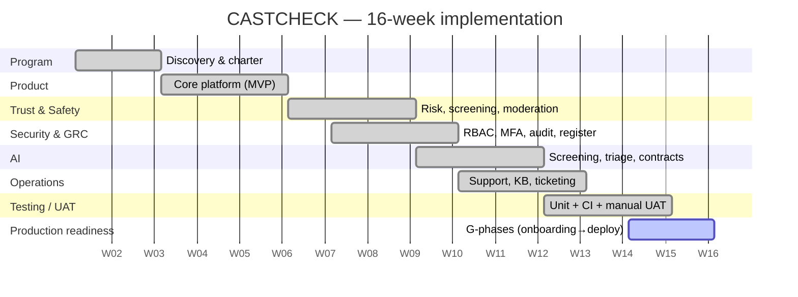

# Project Plan — CASTCHECK

A 16-week implementation plan across seven delivery phases plus UAT and
production readiness. Phases overlap deliberately where dependencies allow.

## Phase schedule

| Phase | Weeks | Workstream (WBS) | Key exits |
|-------|-------|------------------|-----------|
| P1 Discovery | 1–2 | 1 Program mgmt | Charter, scope, roadmap, risks |
| P2 Core platform (MVP) | 3–5 | 2 Product | Auth, profile, feed, filters, detail, save, tracker, seed |
| P3 Trust & Safety | 6–8 | 3 Trust | Risk model, screening, verification states, moderation, reports |
| P4 Security & GRC | 7–9 | 4 Security | RBAC, MFA, audit log, risk register, controls, incidents |
| P5 AI | 9–11 | 5 AI | Screening narrative, triage, career-fit, contract analysis, guardrails |
| P6 Operations | 10–12 | 6 Ops | Support center, tickets, knowledge base, escalation |
| P7 Testing / UAT | 12–14 | 7 Platform | Unit suite + CI, manual UAT sign-off |
| P8 Production readiness | 15–16 | 7 Platform | Env/onboarding, fail-closed, recovery, object storage, Redis, error/legal/a11y, deploy config |

## Critical dependencies (must respect order)

1. **Authentication → RBAC → Audit logging.** Identity precedes roles; roles
   precede meaningful privileged-action auditing. (P2 → P4)
2. **Verification engine → Moderation workflow → Application readiness.**
   Screening/verification must produce evidence before moderators can act and
   before a user can safely apply. (P3 → P3 → P2/P3)
3. **Data model → Migration path → Deploy.** Prisma schema stabilizes before the
   Postgres migration and the Vercel/Docker deploy. (P2 → P8 → P8)
4. **AI guardrails → AI features.** The "never invent evidence + always fall back"
   contract is defined before any AI feature ships. (P5)

## Gantt

> Dates are illustrative anchors for the case study; the value is the sequencing
> and dependencies, not the calendar. Actual delivery status is tracked in
> [work-breakdown-structure.md](work-breakdown-structure.md) and
> [executive-dashboard.md](executive-dashboard.md).

## Resource plan (illustrative)

Solo build modeling a small cross-functional team: PM/Program (coordination),
Full-stack Engineering (majority), Security/GRC (controls + threat model),
AI/ML (screening + eval), Support/Design (ops + a11y). Costed in
[budget.md](budget.md).
